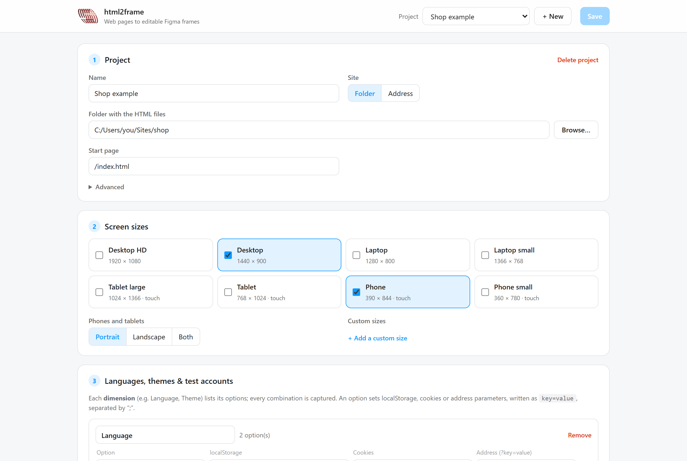
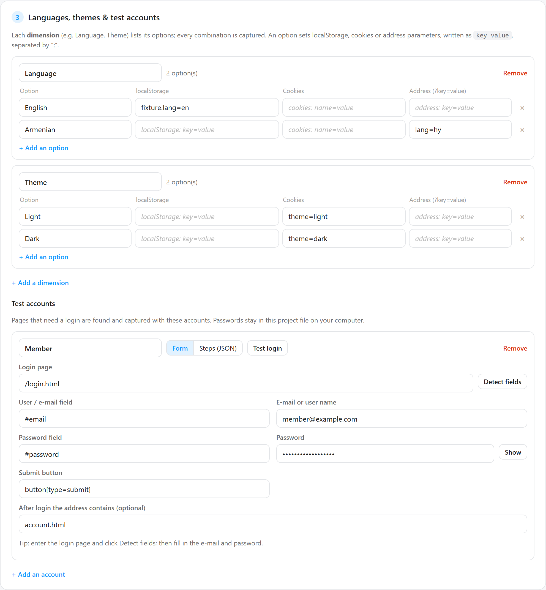
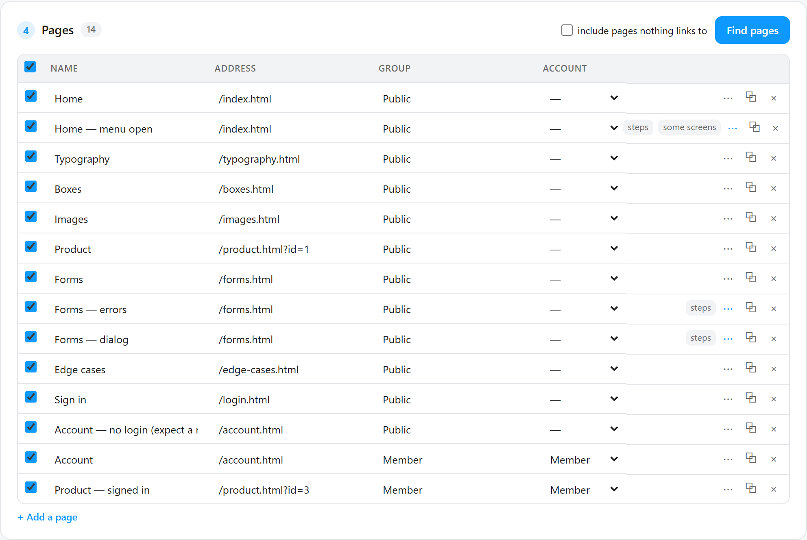
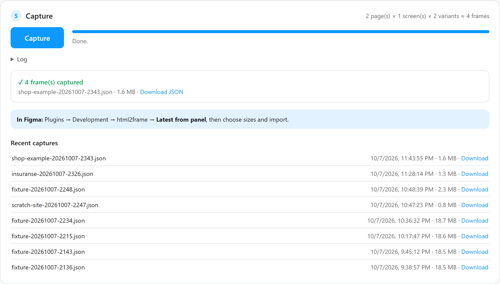
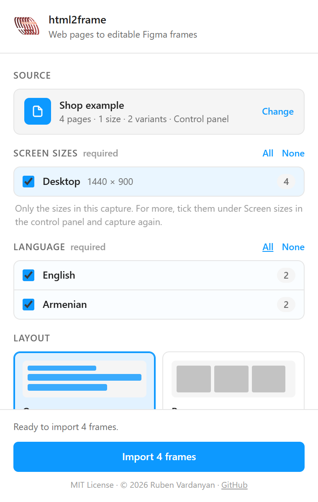

<p align="center"></p>

# html2frame

Turn the pages of a website into **editable Figma designs**: real frames, text layers, vectors and images
(not screenshots), at the screen sizes you choose, in every language and theme of the site, including pages
behind a login.

- Works on the **free Figma plan**: the importer is a Figma plugin you load in the desktop app.
- Everything runs **on your computer**: your site, its test logins and the captures never leave it.
- Windows and macOS (on Linux, start the panel with `npm install && npm start`).

```
your site ──► real browser (capture) ──► JSON (boxes, text, fonts, vectors, images) ──► Figma plugin ──► frames
```

Figma cannot open HTML, so html2frame renders each page in your installed Edge or Chrome, measures everything
that is painted, and the plugin rebuilds it in Figma node by node.

## Contents

1. [What you need](#what-you-need)
2. [Install](#install)
3. [Capture a site with the control panel](#capture-a-site-with-the-control-panel)
4. [Import into Figma](#import-into-figma)
5. [Command line](#command-line)
6. [What comes through](#what-comes-through)
7. [Troubleshooting](#troubleshooting)
8. [For developers](#for-developers)

## What you need

| | |
|---|---|
| **Node.js 18 or newer** | [nodejs.org](https://nodejs.org) (LTS). On macOS also `brew install node`. |
| **Microsoft Edge or Google Chrome** | Already installed on most computers. html2frame uses it; it downloads no browser of its own. |
| **Figma desktop app** | Any plan, including free. The browser version of Figma cannot load development plugins. |
| **Your site** | A folder of HTML/CSS/JS files, or an address of a running site such as `http://localhost:3000`. |

## Install

1. Download this repository: **Code → Download ZIP** on GitHub and unzip it, or
   `git clone https://github.com/Ruben-Vardanyan/html2frame.git`.
2. Start the control panel:
   - **Windows:** double-click **`start.bat`**.
   - **macOS:** double-click **`start.command`**. The first time, macOS may say it cannot be opened: right-click
     the file → **Open** → **Open**. If it opens as text instead, run `chmod +x start.command` once in Terminal.

   The first start installs one package (`playwright-core`, about 13 MB), then your browser opens
   **http://localhost:5600**. Keep the black terminal window open while you work; close it to stop the panel.
3. Load the Figma plugin (once): Figma desktop app → **Plugins → Development → Import plugin from manifest…** →
   choose **`figma-plugin/manifest.json`** in this folder.

## Capture a site with the control panel

The panel is one page with five numbered cards. Changes are saved with **Save** (capturing saves too).



**1. Project.** Click **+ New**, give the project a name and choose the **folder** with your HTML files
(**Browse…** opens your system's folder window: Explorer on Windows, Finder on macOS) or the **address** of a
running site. **Delete project** moves the project file to `projects/deleted/`, from where you can bring it
back.

- *Start page*: where finding pages begins (usually `/index.html`).
- *Advanced → Ready when*: for sites that draw their content with JavaScript, a condition that is true when the
  page is finished, e.g. `!document.documentElement.classList.contains('loading')`. Leave it empty if unsure.
- *Advanced → Replace text*: e.g. `֏=AMD` when a font in Figma lacks a character.

**2. Screen sizes.** Tick the sizes you want: desktop HD, desktop, laptops, tablets and phones, plus custom
sizes. For phones and tablets choose **portrait**, **landscape** or **both**; they are captured as touch devices.

**3. Languages, themes & test accounts.**



- A **dimension** is something the site can switch, such as *Language* or *Theme*. Each option says how: a
  `localStorage` value, a cookie, or an address parameter (`?lang=hy`), written as `key=value`. Every
  combination is captured: 2 languages × 2 themes = 4 versions of each page.
- A **test account** logs in before the pages that need it. Enter the login page and click **Detect fields**:
  html2frame opens the page and fills in the e-mail field, password field and submit button for you. Then type
  the e-mail and password, and optionally a piece of the address you land on after logging in. **Test login**
  shows where it landed, with a screenshot. For special logins (extra fields, two steps), switch the account to
  **Steps (JSON)**. Passwords stay in the project file on your computer (`projects/*.json`, never uploaded and
  not committed to git).

**4. Stored values.** localStorage values set before every page opens, in every language, theme and account:
for example a saved cart or comparison list, so the pages that read it are captured with content. Write each
value exactly as the site stores it (look in the browser's developer tools, Application → Local Storage), e.g.
`[{"id":3}]` or `"en"`. **Table** shows one row per value; **Bulk** shows them all as text, one `key=value` per
line, to paste many at once. A value that starts with `[` or `{` but is not valid JSON is marked red. A
language or theme option's own value for the same key wins.

**5. Pages.** Click **Find pages**: html2frame opens the site, follows its links (as a guest, then logged in
with each account) and fills the list. Pages that only differ by an id (`product.html?id=1…50`) are listed once,
as "+N similar".



Untick pages you don't need, rename them, or change their group (each group becomes a row in Figma). The row
buttons: **⋯** steps before the capture (e.g. `[{"click": ".menu-button"}]` for an open menu, or filling a form
to show its errors), **⧉** duplicate a page as an extra state, **×** remove. **+ Add a page** adds one by hand.

**6. Capture.** Click **Capture** and follow the progress. The estimate shows how many frames you will get.



## Import into Figma

1. In the Figma desktop app, open a design file and run **Plugins → Development → html2frame**.
2. Click **Latest from panel** (the panel must be running), or **Choose file** for a saved capture
   (`captures/*.json`, or one somebody sent you).
3. Tick the **screen sizes**, **languages/themes** and **groups** to import (nothing is ticked at first; the
   button shows how many frames you will get).
4. Choose the **layout**:
   - **One page**: everything on the current Figma page, one **Section** per screen size and variant
     ("Desktop — English · Dark");
   - **Page per screen**: a Figma page for each.
   - **Use Auto Layout**: flex rows and columns (navigation, buttons, cards) become Auto Layout frames where
     Auto Layout reproduces the page exactly; everything else keeps its exact position.
5. Click **Import**. A report lists the frames per section, fonts that were replaced, and any warnings.



Importing again adds the new frames below the existing ones; nothing is overwritten.

## Command line

Everything the panel does is also available in a terminal (from this folder):

```bash
node src/capture.js projects/mysite.json --screens desktop,phone --orientation both
node src/capture.js C:/path/to/site --screens desktop --save projects/mysite.json
node src/crawl.js projects/mysite.json --save projects/mysite.json
```

- `capture.js <settings.json | folder>`: `--screens`, `--orientation`, `--pages "Home,Log In"`, `--out file.json`;
  with a folder every `.html` file becomes a page (`--save` keeps the generated settings, `--ready "js"` sets
  *Ready when*).
- `crawl.js <settings.json | folder>`: finds pages by following links; `--save` adds them to the settings file,
  `--unlinked` also adds files nothing links to, `--depth`, `--max`.
- `node server.js [--open] [--port 5600]` starts the panel without the launcher.

The settings file format is described in [`docs/PLAN.md`](docs/PLAN.md) (*Settings file*), the capture format
in [`docs/FORMAT.md`](docs/FORMAT.md).

## What comes through

- **Layout and boxes:** positions, sizes, background colours, borders (per side, dashed), corner radii, shadows,
  opacity, clipping, linear gradients, background images, CSS `clip-path` (as masks), rotate/scale/translate
  transforms, blur, background blur and blend modes.
- **Text:** editable text layers with font, weight, size, line height, letter spacing, colour, alignment,
  decoration, case and text shadow; multi-column text; vertical text. Each script gets a suitable font: for
  Armenian, the site's Armenian font if Figma has it, otherwise Calibri (then other Armenian fonts).
- **Vectors and images:** inline SVG (including `<use>` sprites) as editable vectors; SVG, PNG, JPEG, GIF and
  WebP images; canvas, video and iframes as images.
- **Forms:** values, placeholders, password dots, selects, checkboxes, radios and toggles.
- **Lists and details:** bullets, numbers and the triangles of `<details>`.
- **Not (yet):** radial gradients, CSS counters, skew transforms, z-index paint order, text that overflows its box
  with an ellipsis, and Auto Layout for plain stacked blocks or grids. The test site's *Edge cases* page
  ([`test/site/edge-cases.html`](test/site/edge-cases.html)) shows each case and what Figma should show.

## Troubleshooting

| Problem | What to do |
|---|---|
| **"Node.js 18 or newer is needed"** | Install it from [nodejs.org](https://nodejs.org), then start again. |
| **"Could not start Microsoft Edge or Google Chrome"** | Install one of them (any recent version). |
| **macOS: "start.command cannot be opened"** | Right-click it → **Open** → **Open** (only the first time). If it opens in a text editor: `chmod +x start.command` in Terminal. |
| **Pages come out half drawn or empty** | The site draws with JavaScript: set **Ready when** in *Project → Advanced*. |
| **"Ready when was not true … captured anyway"** | The condition does not fit this site (e.g. copied from another project): fix or clear it. |
| **A login page instead of the account page** ("landed on /login.html") | Check the test account with **Test login**; add the account to the page in the Pages table. |
| **"content is 469px wide on a 390px screen"** | The page itself overflows sideways on that screen (a real responsive bug on the site). The frame keeps the screen width. |
| **Armenian (or other) text missing in Figma** | Install the site's font, or Calibri. The import report lists the fonts it used. |
| **"Could not reach the control panel"** in Figma | Start the panel (`start.bat` / `start.command`), or use **Choose file**. |
| **Port 5600 is busy** | The panel is probably already running: the launcher then just opens it. |
| **Big capture files** | Every frame carries its images; capture fewer pages, screens or variants at once. |

## For developers

- Plain JavaScript, no build step, Node 18+, one dependency (`playwright-core`).
- Read [`CLAUDE.md`](CLAUDE.md) and [`docs/PLAN.md`](docs/PLAN.md) first; decisions are in
  [`docs/DECISIONS.md`](docs/DECISIONS.md), lessons learned in [`docs/RESEARCH.md`](docs/RESEARCH.md).
- Tests: `node test/mock-figma.js` (the plugin against a fake Figma API) and
  `node src/capture.js examples/fixture.settings.json` (the test site in [`test/site/`](test/site/README.md)).

## License

[MIT](LICENSE) © 2026 Ruben Vardanyan
